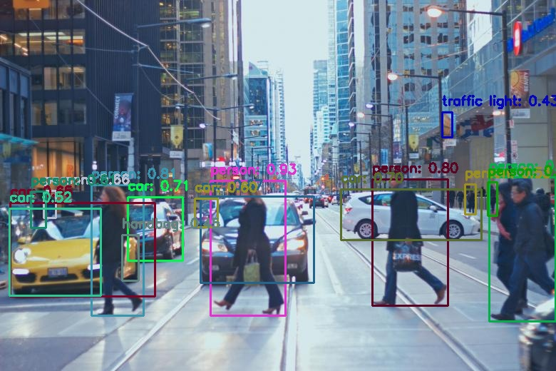
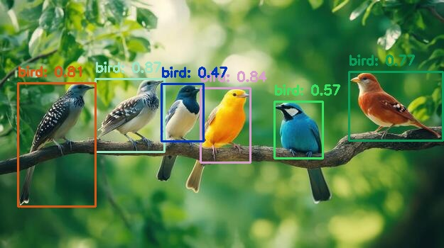
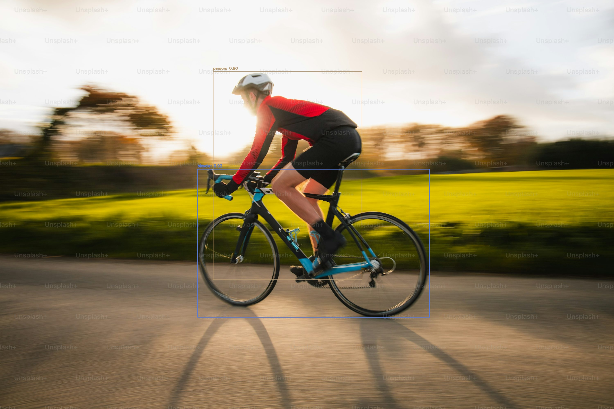

WorldSense-AI  
### Real-Time Image & Video Object Detection System (YOLOv8)

This project started as my attempt to understand how object detection works in real-world systems.
Instead of writing a single script, I structured it like an industry project where image and video
inference, models, and utilities are clearly separated.

### Features Implemented

- Image Object Detection  
- Video Object Detection  
- Multi-object detection  
- Batch video processing  
- CLI-based execution  
- Output saving (images & videos)  

### Tech Stack

- Python  
- YOLOv8 (Ultralytics)  
- OpenCV  
- PyTorch  


### 📁 Project Structure


WorldSense-AI/
│
├── inference/
│   ├── detect_image.py        # Image inference pipeline
│   ├── detect_video.py        # Video inference (single & batch processing)
│
├── models/
│   ├── yolo/                  # YOLOv8 model loader & configs
│   ├── clip/                  # (Planned) Multimodal embeddings
│   ├── vit/                   # (Planned) Vision Transformer models
│   └── ssd/                   # (Planned) SSD-based detection
│
├── data/
│   ├── samples/
│   │   ├── images/            # Sample input images
│   │   └── videos/            # Sample input videos
│   └── labels/                # (Future) Training annotations
│
├── output/
│   ├── images/                # Detected image outputs
│   └── videos/                # Detected video outputs
│
├── utils/
│   └── visualization.py       # Bounding box & overlay utilities
│
├── assets/                    # README visuals (screenshots, GIFs)
├── dashboard/                 # (Future) Analytics / UI dashboard
├── trackers/                  # (Future) Object tracking modules
├── training/                  # (Future) Model training pipelines
│
├── requirements.txt
├── main.py
└── README.md


## ▶️ How to Run

### 1. Create virtual environment & install dependencies:-
```bash
python -m venv venv
source venv/bin/activate
pip install -r requirements.txt
```
### 2. How to Run Inference:-

Image Detection
Put your input images inside:
data/samples/images/

Run the image detection pipeline:
python -m inference.detect_image

Detected images will be automatically saved to:
output/images/

### 3. Video Detection (Single Video):-

Place the video file inside:
data/samples/videos/

Run detection on a specific video:
python -m inference.detect_video market.mp4

The detected video will be saved to:
output/videos/

### Video Detection (Batch Mode):-

To run detection on all videos present in the folder:
python -m inference.detect_video

### Image Detection Results
Sample Outputs





### 🎥 Video Detection Demo
### Market Scene Detection
GIF generated from object detection on a crowded market video:


### Highway Scene Detection
GIF generated from object detection on a highway traffic video:


### Future Work
-Live camera detection
-Object tracking (DeepSORT / ByteTrack)
-Scene understanding
-CLIP-based zero-shot detection
-Web dashboard & analytics
-Model training pipelines

### Author
Built with ❤️ by Arya Verma
# minor update
